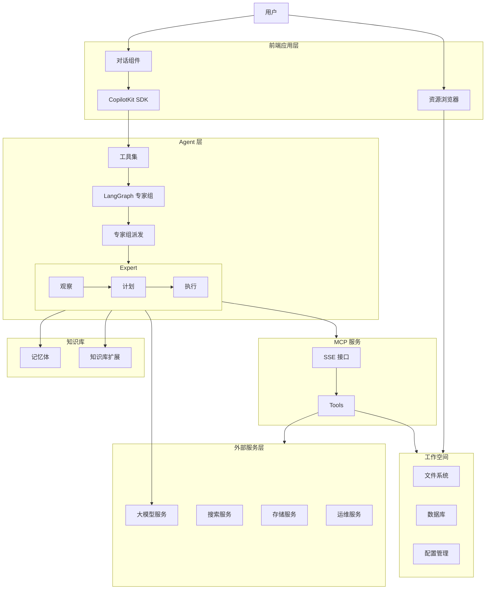

# Exalith

一个基于 LangGraph 和 CopilotKit 的智能代理客户端，用于连接和管理 MCP 服务器。

## 环境要求

- Node.js 20+
- pnpm 8+
- Python 3.12+ (用于 Agent 开发)

## 快速开始

### 1. 安装依赖

```bash
mkdir filesystem
pnpm install
cd agent
poetry install
```

### 2. 设置环境变量

```bash
touch .env
touch ./packages/mcp-server/.env
```

在 `.env` 文件中配置以下环境变量：

```sh
LANGSMITH_API_KEY=your_langsmith_api_key
OPENAI_MODEL=deepseek-chat
OPENAI_API_KEY=your_openai_api_key
OPENAI_BASE_URL=your_openai_api_base_url
OSS_BASE_PATH=./filesystem
```

### 3. 启动开发服务器

```bash
pnpm run dev
```

这将同时启动：

- 前端开发服务器 (<http://localhost:3000>)
- Agent 开发服务器 (<http://localhost:8123>)

## 项目结构

项目采用 monorepo 结构，主要包含以下部分：

1. `/agent` - LangGraph 智能代理
   - 负责与 MCP 服务器通信
   - 管理工具调用和状态同步
   - 使用 Python 开发

2. `/app` - 前端应用
   - 基于 Next.js 15
   - 使用 CopilotKit 构建 UI
   - 支持实时状态同步

3. `/packages/server` - MCP 服务器
   - 提供 SSE 接口
   - 管理工具执行
   - 支持配置文件导入

## 架构图



## 开发指南

### 前端开发

```bash
pnpm run dev-frontend
```

### Agent 开发

```bash
pnpm run dev-agent
```

### 构建生产版本

```bash
pnpm run build
```

## 技术栈

- 前端：Next.js 15, React 19, CopilotKit
- Agent：LangGraph, Python
- UI：Ant Design, Tailwind CSS
- 工具：pnpm, TypeScript

## 许可证

MIT License
