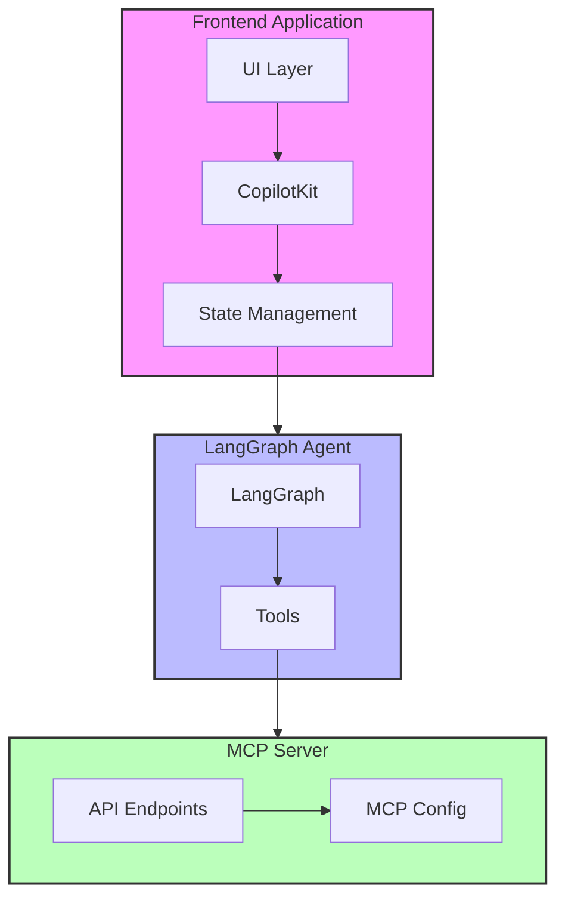

<https://github.com/user-attachments/assets/f72e1f7d-3c84-4429-a465-23dff3d3bd63>

# Getting Started

## Set Up Environment Variables

```sh
touch .env
```

Add the following inside `.env` at the root:

```sh
LANGSMITH_API_KEY=
OPENAI_MODEL=
OPENAI_API_KEY=
OPENAI_BASE_URL=
```

## Development

```bash
pnpm run dev
```

Then, open [http://localhost:3000](http://localhost:3000) in your browser.

## Architecture

The codebase is split into two main parts:

1. `/agent` **folder** – A LangGraph agent that connects to MCP servers and calls their tools.
2. `/app` **folder** – A frontend application using CopilotKit for UI and state synchronization.
3. `/packages/server` **folder** – A MCP server that can be used to run the agent.
   1. `pnpm dev` – Starts the server.
   2. `/mcp-config.example.json` - An example MCP config file can import from frontend.


