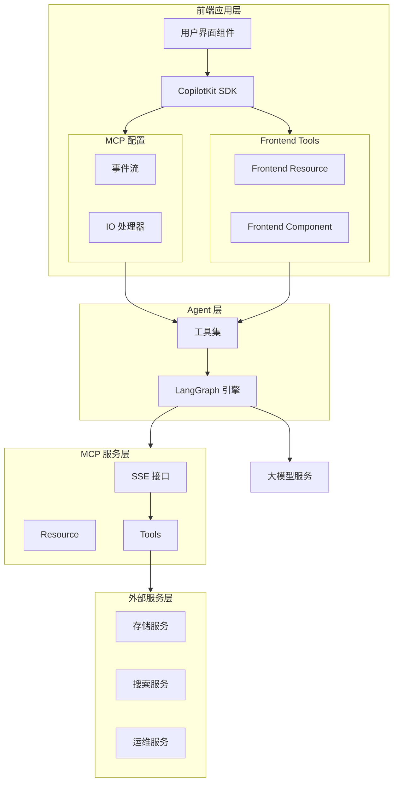

```mermaid
graph TB
    %% 定义样式
    classDef frontendStyle fill:#f9f0ff,stroke:#9333ea,stroke-width:2px
    classDef agentStyle fill:#dbeafe,stroke:#2563eb,stroke-width:2px
    classDef serverStyle fill:#ecfdf5,stroke:#059669,stroke-width:2px
    classDef serviceStyle fill:#fef2f2,stroke:#dc2626,stroke-width:2px

    subgraph Frontend[前端应用层]
        UIComponent[用户界面组件]
        CopilotKitSDK[CopilotKit SDK]
        subgraph ClientTools[Frontend Tools]
            UIState[Frontend Resource]
            ToolsState[Frontend Component]
        end
        subgraph MCPConfig[MCP 配置]
            EventStream[事件流]
            IOHandler[IO 处理器]
        end
    end


    MCPConfig --> AgentToolkit

    subgraph Agent[Agent 层]
        LangGraphEngine[LangGraph 引擎]
        AgentToolkit[工具集]
    end

    subgraph Server[MCP 服务层]
        APIEndpoint[SSE 接口]
        ResourceManager[Resource]
        ToolManager[Tools]
        APIEndpoint --> ToolManager
    end
    ToolManager --> ExternalServices

    LLMService[大模型服务]
    subgraph ExternalServices[外部服务层]
        StorageService[存储服务]
        SearchService[搜索服务]
        OperationService[运维服务]
    end
    
    %% Frontend 连接关系
    UIComponent --> CopilotKitSDK
    CopilotKitSDK --> ClientTools
    CopilotKitSDK --> MCPConfig
    
    %% Agent 连接关系
    ClientTools --> AgentToolkit
    AgentToolkit --> LangGraphEngine
    
    %% 外部服务连接关系
    LangGraphEngine --> LLMService
    LangGraphEngine --> Server

```
