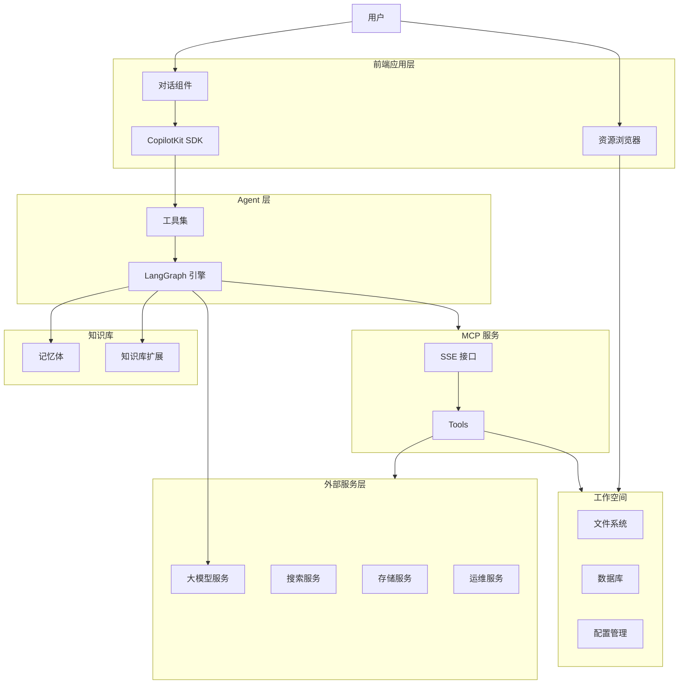

```mermaid
flowchart TB
    subgraph Frontend["前端应用层"]
        UI[对话组件]
        SDK[CopilotKit SDK]
        Tools[资源浏览器]
    end
    subgraph Agent["Agent 层"]
        Engine[LangGraph 引擎]
        Toolkit[工具集]
    end
    subgraph KnowledgeBase["知识库"]
        Memory[记忆体]
        ExtKnowledge[知识库扩展]
    end
    subgraph Server["MCP 服务"]
        Endpoint[SSE 接口]
        ToolMgr[Tools]
    end
    subgraph Workspace["工作空间"]
        FS[文件系统]
        DB[数据库]
        Config[配置管理]
    end
    subgraph External["外部服务层"]
        Storage[存储服务]
        Search[搜索服务]
        LLM[大模型服务]
        Ops[运维服务]
    end

    Humnan["用户"] --> UI & Tools
    Tools --> Workspace
    Engine --> Memory & ExtKnowledge & LLM & Server
    Endpoint --> ToolMgr
    ToolMgr --> External & Workspace
    UI --> SDK
    Toolkit --> Engine
    SDK --> Toolkit

```
